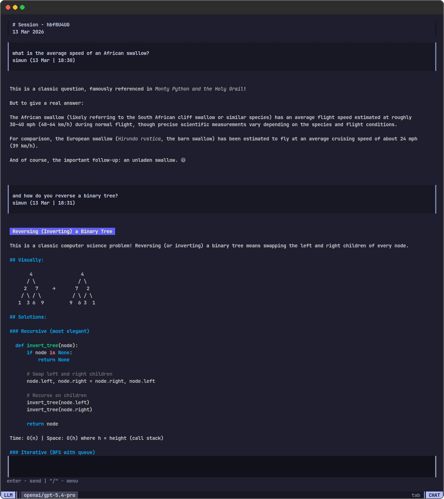
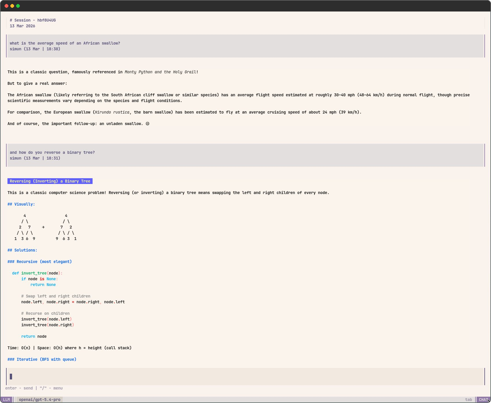
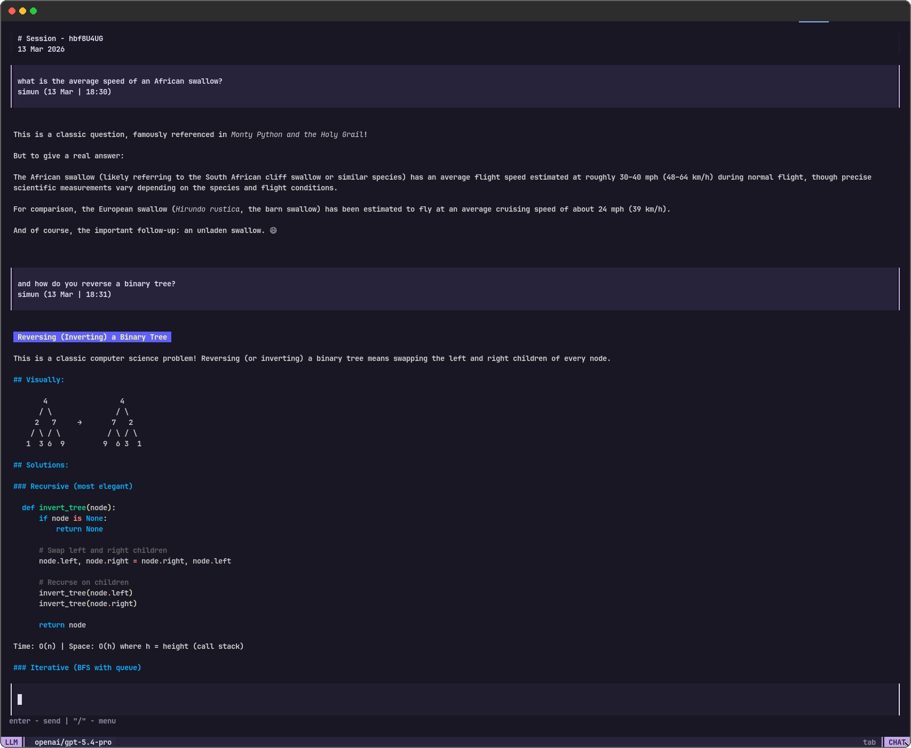
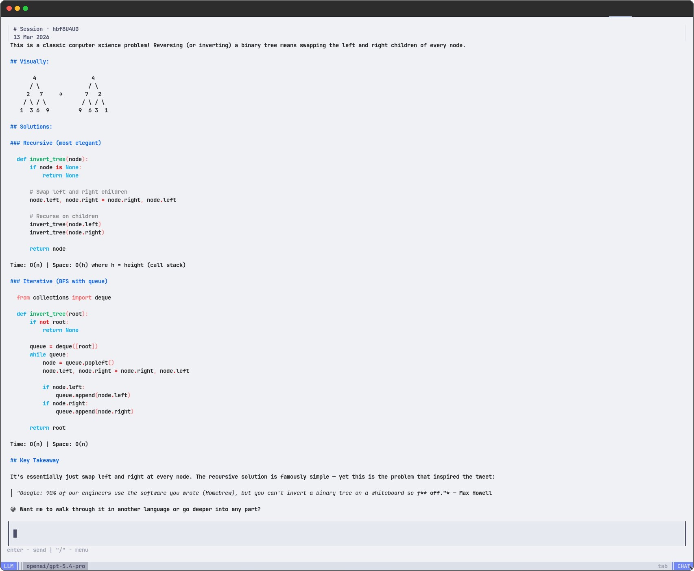
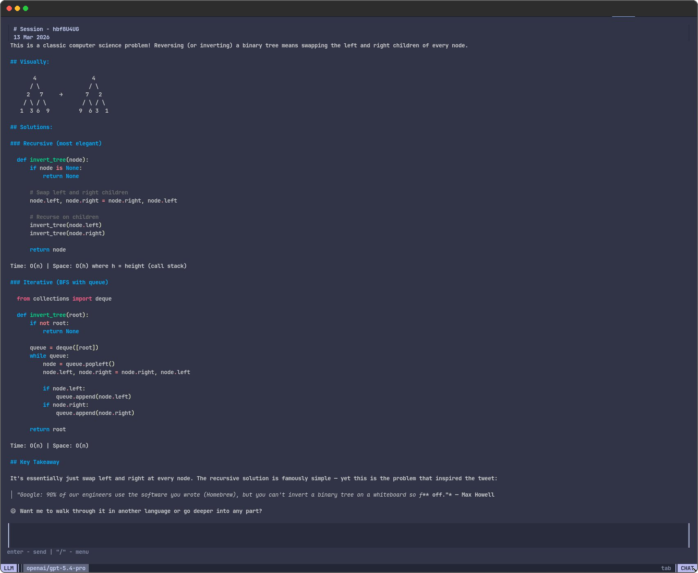
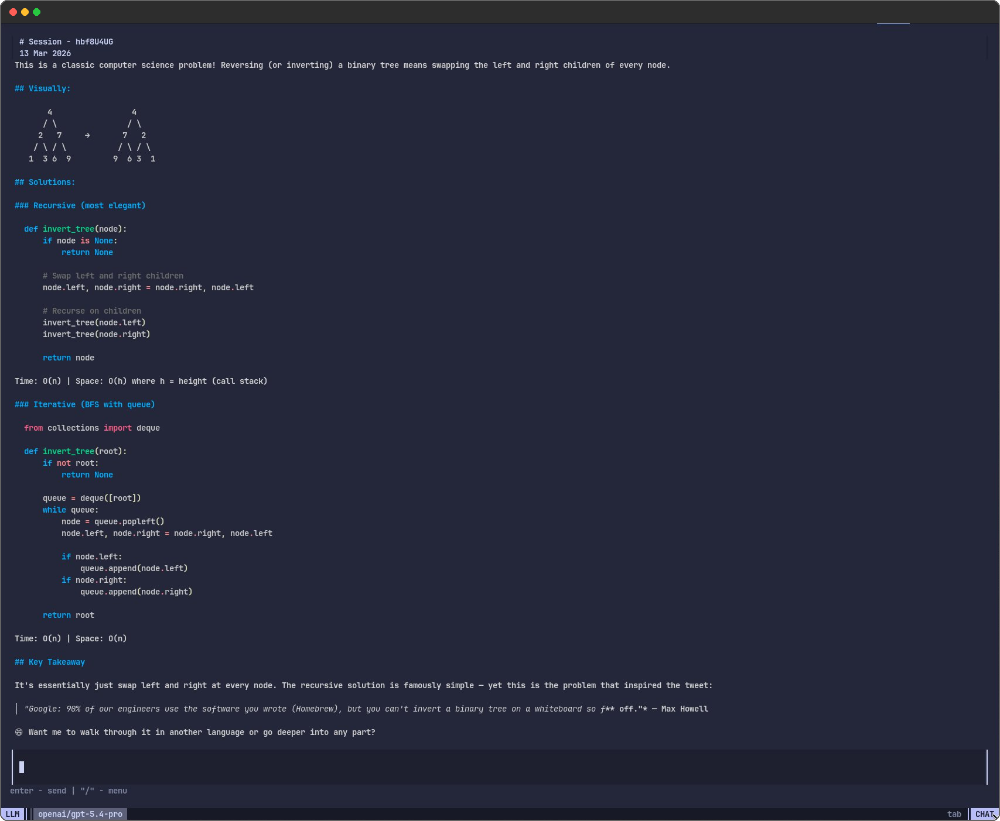
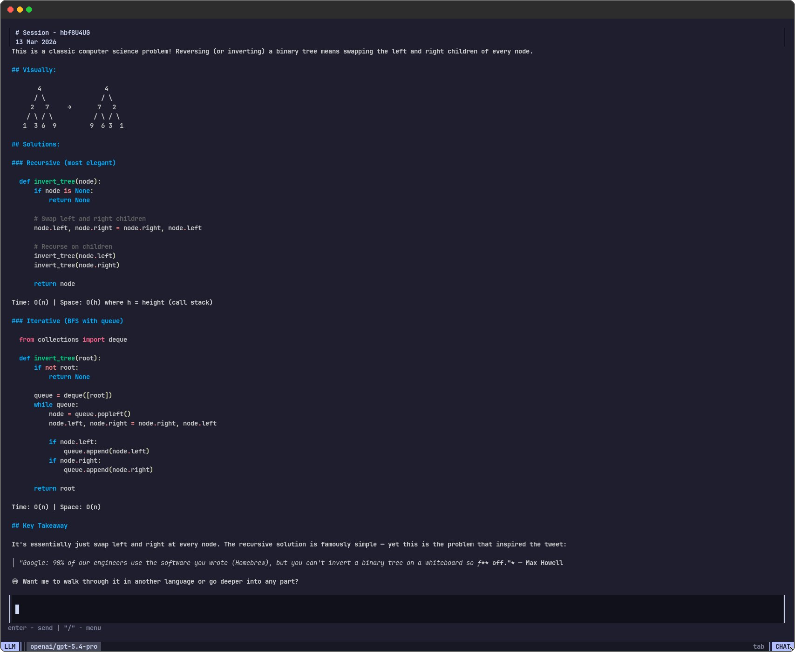

<p align="center">
  <picture>
    <source media="(prefers-color-scheme: dark)" srcset="./docs/clipt-banner-light.svg">
    <source media="(prefers-color-scheme: light)" srcset="./docs/clipt-banner-dark.svg">
    
  </picture>
</p>
<p align="center"> Chat TUI for your agents and LLMs</p>

<p align="center">
  
</p>

# Quickstart
Clip is packaged with a default SQLite storage and OpenRouter provider. You need to have [go installed](https://go.dev/doc/install) to run Clipt.

Openrouter API provides quick access to a [large set of llms](https://openrouter.ai/models).

```
export OPENROUTER_API_KEY=<your-api-key>
```

Get the key from [https://openrouter.ai/](https://openrouter.ai/)

Put this in a main.go file: 

```go

package main

import (
	"github.com/struki84/clipt"
	"github.com/struki84/clipt/providers"
	"github.com/struki84/clipt/storage"
	"github.com/struki84/clipt/tui/schema"
	"github.com/struki84/clipt/tui/style"
)

func main() {
	models := []schema.ChatProvider{}
	dbPath := "./basic.db"

  // customize the list visit https://openrouter.ai/models
	llms := []string{
		"openai/gpt-5.4-pro",
		"openai/gpt-5.4",
		"openai/gpt-5.3-chat",
		"openai/gpt-5.3-codex",
		"anthropic/claude-opus-4.6",
		"anthropic/claude-sonnet-4.6",
		"x-ai/grok-4.1-fast",
		"google/gemini-3-flash-preview",
		"deepseek/deepseek-v3.2",
	}

	sqlite := *storage.NewSQLite(dbPath)

	for _, llm := range llms {
		models = append(models, providers.NewOpenRouter(llm, sqlite))
	}

	clipt.Render(
		models,
		clipt.WithStorage(sqlite),
		clipt.WithDebugLog("debug.log"),
		clipt.WithStyle(style.Default(style.CatppuccinMocha)),
	)
}
```

Run it directly, 

```
go run main.go
```

or build a binary,

```
go build -o my_chat_app
```

and then run it.

```
./my_chat_app
```

Add the path to binary in your `$PATH` and run it as a terminal app. 

To learn more about customzing Clipt, checkout [examples/](https://github.com/Struki84/clipt/blob/master/examples) directory.

# About

Clipt is a chat TUI written in Go, built on top of [charm/bubbletea](https://github.com/charmbracelet/bubbletea). It's designed to be used as a Go module — attach any LLM or custom agent by implementing the `ChatProvider` interface, and swap in your own database by implementing the `SessionStorage` interface.

The main entry point is `clipt.Render()`, which accepts a list of providers and functional options for configuration:

Set a session storage backend:
```go
clipt.Render(providers, clipt.WithStorage(myStorage))
```

Apply a custom color scheme:
```go
clipt.Render(providers, clipt.WithStyle(style.Default(style.CatppuccinMocha)))
```

Enable debug logging to a file:
```go
clipt.Render(providers, clipt.WithDebugLog("debug.log"))
```

Replace the default slash-commands:
```go
clipt.Render(providers, clipt.WithCmds(myCommands))
```

Append custom commands alongside the built-in ones:
```go
clipt.Render(providers, clipt.WithAddedCmds(extraCommands))
```

## Providers

Any LLM or agent can be plugged into Clipt by implementing the `ChatProvider` interface:

```go
type ChatProvider interface {
	Name() string
	Type() ProviderType
	Description() string
	Run(ctx context.Context, input string, session ChatSession) error
	Stream(ctx context.Context, callback func(ctx context.Context, msg Msg) error)
}
```

`Stream` is called once during initialization to register a callback. When generating a response, invoke that callback with `Msg` values where `Stream: true` — the TUI accumulates chunks into a single AI message and re-renders as content arrives. `Run` is called in a goroutine when the user sends a message, so it should be safe for concurrent use.

Below is a custom Anthropic provider example using [langchain-go](https://github.com/tmc/langchaingo) as the client:

```go

import (
	"context"
	"fmt"
	"log"
	"time"

	"github.com/struki84/clipt/storage"
	"github.com/struki84/clipt/tui/schema"
	"github.com/tmc/langchaingo/llms"
	"github.com/tmc/langchaingo/llms/anthropic"
)

type Anthropic struct {
	LLM           *anthropic.LLM
	streamHandler func(ctx context.Context, chunk []byte) error
	currentModel  string
	storage       storage.SQLite
}

func NewAnthropic(model string, storage storage.SQLite) *Anthropic {
	llm, err := anthropic.New(anthropic.WithModel(model))
	if err != nil {
		log.Printf("can't create model: %v", err)
		return nil
	}

	return &Anthropic{
		LLM:          llm,
		currentModel: model,
		storage:      storage,
	}
}

func (model *Anthropic) Type() schema.ProviderType {
	return schema.LLM
}

func (model *Anthropic) Name() string {
	return model.currentModel
}

func (model *Anthropic) Description() string {
	desc := fmt.Sprintf("%s by Anthropic", model.currentModel)
	return desc
}

func (model *Anthropic) Stream(ctx context.Context, callback func(ctx context.Context, msg schema.Msg) error) {
	model.streamHandler = func(ctx context.Context, chunk []byte) error {
		callback(ctx, schema.Msg{
			Stream:    true,
			Role:      schema.AIMsg,
			Content:   string(chunk),
			Timestamp: time.Now().Unix(),
		})

		return nil
	}
}

func (model *Anthropic) Run(ctx context.Context, input string, session schema.ChatSession) error {
	buffer, err := model.storage.LoadMsgs(session.ID)
	if err != nil {
		log.Println(err)
		return err
	}

	userMsg := schema.Msg{
		Role:      schema.UserMsg,
		Content:   input,
		Timestamp: time.Now().Unix(),
	}

	err = model.storage.SaveMsg(session.ID, userMsg)
	if err != nil {
		log.Println(err)
		return err
	}

	content := []llms.MessageContent{
		llms.TextParts(llms.ChatMessageTypeSystem, "You are a helpful assistant!"),
		llms.TextParts(llms.ChatMessageTypeSystem, "CHAT HISTORY: \n"+buffer),
		llms.TextParts(llms.ChatMessageTypeHuman, input),
	}

	response, err := model.LLM.GenerateContent(ctx, content, llms.WithStreamingFunc(model.streamHandler))
	if err != nil {
		fmt.Println(err)
		return err
	}

	aiMsg := schema.Msg{
		Role:      schema.AIMsg,
		Content:   response.Choices[0].Content,
		Timestamp: time.Now().Unix(),
	}

	err = model.storage.SaveMsg(session.ID, aiMsg)
	if err != nil {
		log.Println(err)
		return err
	}

	return nil
}
```

## Storage

Chat history persistence is handled through the `SessionStorage` interface. Implement it to use any backend — SQL, NoSQL, flat files, etc. If no storage is provided, Clipt still works but sessions won't persist between runs.

```go
type SessionStorage interface {
	NewSession() (ChatSession, error)
	ListSessions() []ChatSession
	LoadRecentSession() (ChatSession, error)
	LoadSession(string) (ChatSession, error)
	SaveSession(ChatSession) (ChatSession, error)
	DeleteSession(string) error
}

type ChatSession struct {
	ID        string
	Title     string
	Msgs      []Msg
	CreatedAt int64
}
```

The interface covers the full session lifecycle: creating, listing, loading, saving, and deleting. See [storage/sqlite.go](https://github.com/Struki84/clipt/blob/master/storage/sqlite.go) for a working reference implementation.

## Styling

Clipt uses [lipgloss](https://github.com/charmbracelet/lipgloss) for TUI styling and [glamour](https://github.com/charmbracelet/glamour) for markdown rendering of AI responses. Every visual element has its own style definition in the `LayoutStyle` struct.

### TUI

The default style in [tui/style/default.go](https://github.com/Struki84/clipt/blob/master/tui/style/default.go) can be used as a starting point for custom styling. Color and text changes are safe; modifying spatial properties (padding, margins, widths, heights) may break the layout.

```go
type LayoutStyle struct {
	WhitespaceBGcolor string
	ContentView       lipgloss.Style
	InfoLine          lipgloss.Style

	StatusLine struct {
		BaseStyle    lipgloss.Style
		ProviderType lipgloss.Style
		ProviderName lipgloss.Style
		Loader       lipgloss.Style
		ModeLabel    lipgloss.Style
		ModeName     lipgloss.Style
	}

	Menu struct {
		ContentView  lipgloss.Style
		ItemNormal   lipgloss.Style
		ItemSelected lipgloss.Style
		Description  lipgloss.Style
	}

	Chat struct {
		ContentView lipgloss.Style
		Header      lipgloss.Style
		Input       lipgloss.Style

		Msg struct {
			User     lipgloss.Style
			AI       lipgloss.Style
			Sys      lipgloss.Style
			Err      lipgloss.Style
			Internal lipgloss.Style
			Glamour  ansi.StyleConfig
		}
	}
}
```

### Colorscheme

The default style ships with six built-in color schemes:

- Light
- Dark
- CatppuccinLatte
- CatppuccinFrappe
- CatppuccinMacchiato
- CatppuccinMocha

<p align="center">
  
  
</p>
<p align="center">
  
  
</p>
<p align="center">
  
  
</p>

Currently, a custom color scheme can only be added as part of a new custom `LayoutStyle` — there's no way to swap just the colors independently of the full style definition.

### Menu

The slash-command menu can be extended with custom commands by implementing the `CmdItem` interface. Use `WithCmds` to replace the defaults entirely, or `WithAddedCmds` to append your own.

```go
type CmdItem interface {
	list.Item

	Title() string
	Description() string
	Execute(tea.Model) (tea.Model, tea.Cmd)
}
```

The built-in commands (`/models`, `/agents`, `/sessions`, `/new`, `/delete`, `/exit`) all implement `CmdItem` and can be freely combined with your custom commands via `WithAddedCmds`.

When building a custom command, the `Execute` method receives the current state as a `tea.Model` — cast it to `tui.LayoutView` to access the chat, menu, providers, and storage:

```go
type ClearChatCmd struct{}

func (cmd ClearChatCmd) Title() string       { return "/clear" }
func (cmd ClearChatCmd) Description() string { return "Clear current chat messages" }
func (cmd ClearChatCmd) FilterValue() string { return "clear" }
func (cmd ClearChatCmd) Execute(model tea.Model) (tea.Model, tea.Cmd) {
	layout := model.(tui.LayoutView)

	layout.Chat.Msgs = []schema.Msg{}
	layout.Chat.Viewport.SetContent(layout.Chat.RenderMsgs())
	layout.Chat.Input.SetValue("")
	layout.Menu = layout.Menu.Close()

	return layout, nil
}
```

Then register it:

```go
clipt.Render(providers, clipt.WithAddedCmds([]list.Item{ClearChatCmd{}}))
```

## Acknowledgments
 
The default TUI styling in Clipt was heavily inspired by and originally based on [opencode.ai](https://github.com/anomalyco/opencode) — a fantastic terminal-based AI tool that set the bar for how good a chat TUI can look. 

The color schemes, layout structure, and overall visual language of the default style are an homage to their work. If you like how Clipt looks out of the box, go check out opencode.

## Roadmap

#### version 0.1.2
- [ ] [https://github.com/Struki84/clipt/issues/2](https://github.com/Struki84/clipt/issues/2) 
- [ ] [https://github.com/Struki84/clipt/issues/3](https://github.com/Struki84/clipt/issues/3) 
- [ ] [https://github.com/Struki84/clipt/issues/4](https://github.com/Struki84/clipt/issues/4) 
- [ ] [https://github.com/Struki84/clipt/issues/5](https://github.com/Struki84/clipt/issues/5) 
- [ ] [https://github.com/Struki84/clipt/issues/6](https://github.com/Struki84/clipt/issues/6) 
- [ ] [https://github.com/Struki84/clipt/issues/7](https://github.com/Struki84/clipt/issues/7) 
- [ ] [https://github.com/Struki84/clipt/issues/8](https://github.com/Struki84/clipt/issues/8) 
- [ ] [https://github.com/Struki84/clipt/issues/9](https://github.com/Struki84/clipt/issues/9) 

#### version 0.2.0
- [ ] [https://github.com/Struki84/clipt/issues/10](https://github.com/Struki84/clipt/issues/10) 
